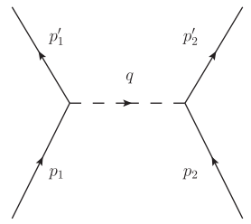

+++
date = '2025-10-21T03:42:49+08:00'
draft = false
title = '标量场真空极化的重整化'
+++

# 背景

考虑一个有质量的复标量场 $ \phi $ 和一个无质量的实标量场 $ \chi $ 耦合，总拉氏量可以写作
$$
\mathcal{L}_B = \partial_\mu \phi^* \, \partial^\mu \phi - m^2\phi^* \phi + {1 \over 2} \partial_\mu \chi \, \partial^\mu \chi - \lambda \phi^* \phi \chi
$$
相应地有费曼规则：
- 顶角： $ - i \lambda $
- $ \phi $ 传播子： $ i\over{p^2 -m^2 + i \epsilon } $
- $ \chi $ 传播子： $ i\over{p^2 + i \epsilon } $

于是我们可以考虑一个简单的 $ \phi - \phi $ 散射过程，

它的树图振幅可以简单地得到：
$$
\mathcal{M}^{(0)} = -i {\lambda^2 \over q^2} 
$$
还有另外一个交换出射粒子的图，但对于我们研究的主题不重要。

考虑下面的高阶图，$ \chi $ 在传播过程中产生一对虚 $ \phi $ 粒子，

可以写出这个图的振幅为
$$
\mathcal{M}^{(1)} = {\lambda^4 \over q^4} \int {\mathrm{d}^4 k \over (2\pi)^4} {1 \over {k^2 - m^2 +i \epsilon}} {1 \over {(k-q)^2 - m^2 +i \epsilon}}
$$
立刻会发现这个积分是发散的。积分测度中含有 $ |k|^3 $，使得总的结果以 $ \ln{|k|} $ 的形式发散，这样就没法得到有意义的振幅修正。为了得到有物理意义的结果，需要“把无穷大扫进地毯下面”。

如果重新观察这两个振幅，可以发现高阶图相当于在 $ \chi $ 的传播子上乘了一个因子，可以写为
$$
G_\chi^{(1)}=G_\chi^{(0)} \, \lambda^2 {i \over q^2} \, I(q)
$$
其中
$$
I(q) = \int {\mathrm{d}^4 k \over (2\pi)^4} {1 \over {k^2 - m^2 +i \epsilon}} {1 \over {(k-q)^2 - m^2 +i \epsilon}}
$$

# 积分计算
## Feynman 改写

先改写一下这个积分，纯粹为了方便后面的处理。使用如下的等式：
$$
{1 \over {A B}} = \int_0^1 \mathrm{d}x {1 \over {[x A + (1-x) B]^2}} = \int_0^1 \mathrm{d}x \int_0^1 \mathrm{d}y \: \delta(x+y-1) \, {1 \over {[x A + y B]^2}} 
$$
重写后的分母为
$$
\begin{aligned}
D &= x(k^2 - m^2 +i \epsilon) + y[(k-q)^2 - m^2 +i \epsilon] \\
  &= k^2 - 2 y q k + y q^2 - m^2 + i \epsilon \\
  &= (k - yq)^2 + xyq^2 - m^2 + i \epsilon \\
  &= l^2 - \Delta + i \epsilon
\end{aligned}
$$
在第三个等号中使用了 $ x + y = 1 $，最后对 $ k $ 做一个 Shift，做变量替换 $ l = k - yq $ 和 $ \Delta = - xyq^2 + m^2 $，就可以把原积分改写为
$$
\int {\mathrm{d}^4 k \over (2\pi)^4} {1 \over {k^2 - m^2 +i \epsilon}} {1 \over {(k-q)^2 - m^2 +i \epsilon}} \\
= \int_0^1 \mathrm{d}x \int_0^1 \mathrm{d}y \: \delta(x+y-1) \, {1 \over (2\pi)^4} \int {\mathrm{d}^4 l} {1 \over {(l^2 - \Delta + i\epsilon)^2}}
$$

## Wick 旋转

观察这一个积分，其是在闵科夫斯基空间下的四维积分，为了方便地对其应用截断并且方便计算，可以使用 Wick 旋转。
考虑对 $ l^0 $ 的积分：
$$
\int_{-\infty}^{+\infty}\mathrm{d}l^0 {1 \over {[(l^0)^2-|\vec{l}|^2 - \Delta + i \epsilon]^2}}
$$
是一个实积分，然而计算这个积分其实可以看作一个围绕复平面上半平面的围道积分，因为积分函数很显然地在 $ \infty $ 变为 0。于是积分值仅跟极点的留数有关，而上半平面的极点仅有 $ l^0 = -\sqrt{|\vec{l}|^2+\Delta} + i \epsilon $，所以可以把围道改为沿复平面左半平面，也就是说可以改写成沿虚轴的积分：
$$
\int_{-i\infty}^{+i\infty}\mathrm{d}l^0 {1 \over {[(l^0)^2-|\vec{l}|^2 - \Delta + i \epsilon]^2}}
$$
再作一个变量替换 $ i l^4 = l^0 $，就可以得到
$$
\int_{-\infty}^{+\infty}\mathrm{d}l^0 {1 \over {[(l^0)^2-|\vec{l}|^2 - \Delta + i \epsilon]^2}} = i \int_{-\infty}^{+\infty}\mathrm{d}l^4 {1 \over {[- (l^4)^2 - |\vec{l}|^2 - \Delta + i \epsilon]^2}}
$$
闵科夫斯基空间下的积分也就可以改写欧几里德空间下的积分，这时候扔掉 $ i \epsilon $ 也没关系了，因为极点不在虚轴上（在 $ \Delta $ 中，$ q^2 $ 是小于 0 的，保证了极点在实轴上）：
$$
\int {\mathrm{d}^4 l} {1 \over {(l^2 - \Delta + i\epsilon)^2}} = i \int {\mathrm{d}^4 \bm{l_E}} {1 \over {(\bm{l_E}^2 + \Delta )^2}}
$$

## 应用硬截断

下面考察四维欧几里德空间的积分，应用四维球坐标，并且对 $ l_E $ 应用一个截断 $ \Lambda $（这个截断是洛伦兹不变的，变换回闵氏空间之后可以看出来，然而如果在上面的闵氏空间中先对 $ l^0 $ 做围道积分再对三维动量作截断的话，那截断就不是洛伦兹不变的）：
$$
\int {\mathrm{d}^4 \bm{l_E}} {1 \over {(\bm{l_E}^2 + \Delta)^2}} =\lim_{\Lambda \to + \infty} \int \mathrm{d}\Omega_4 \int_{0}^{\Lambda}\mathrm{d}l_E {{l_E}^3 \over {({l_E}^2 + \Delta)^2}}
$$
对这个积分可以作换元然后直接求解
$$
\begin{aligned}
\int_{0}^{\Lambda}\mathrm{d}l_E {{l_E}^3 \over {({l_E}^2 + \Delta)^2}} &= {1 \over 2} \int_{0}^{\Lambda}\mathrm{d}{l_E}^2 {{l_E}^2 \over {({l_E}^2 + \Delta)^2}} \\ 
&= {1 \over 2} \int_{0}^{\Lambda}\mathrm{d}{l_E}^2 \left[{1 \over {{l_E}^2 + \Delta}} - {\Delta \over {({l_E}^2 + \Delta)^2}}\right] \\
&= {1 \over 2} \left( \ln{{\Lambda^2 + \Delta} \over \Delta} - {\Lambda^2 \over \Lambda^2  + \Delta} \right) \\
&= {1 \over 2} \left( \ln{{\Lambda^2} \over \Delta(x,y,q^2)} - 1 \right)
\end{aligned}
$$
把上面的所有结果都代入到一开始的积分里，我们可以得到 $ I(q) $（四维球坐标的方向部分积分为 $ 2 \pi^2 $）：
$$
I(q) = {i \over 16 \pi^2 } (\ln{\Lambda^2 \over \mu^2} - 1 - \int_0^1\mathrm{d}x \ln{\Delta \over \mu^2})
$$
其中引入的 $ \mu $ 是一个任意的质量标度，保证对数内是无量纲的。

## 得出 $ \chi $ 传播子并重整化

考虑更多的圈图（两圈图，三圈图等等）可以发现 $ \chi $ 的总传播子为一个等比数列，有
$$
G_\chi(q) = \sum_{n=0}^{\infty}G_\chi^{(n)} ={i \over q^2 - i \lambda^2 I(q)}
$$
然而我们敏锐地发现，在 $ I(q) $ 中发散的部分 $ \ln\Lambda^2 $ 是不依赖于 $ q $ 的。这意味着如果我们在裸拉氏量中为 $ \chi $ 加入一个和这个发散完全相同的质量项，就可以把这一项从最终的传播子中消去。即
$$
\mathcal{L} = \mathcal{L}_B - {1 \over 2}M^2\chi^2
$$
其中 $ M = {\lambda^2 \over 16 \pi^2} \ln{\Lambda^2 \over \mu^2} + M_0^2 $，加入 $ M_0 $ 是为了保证 $ q = 0 $ 时传播子退回到无修正的传播子。
于是修正后的传播子就变为
$$
G_\chi(q) = {i \over q^2 - {\lambda^2 \over 16 \pi^2}(\int_0^1\mathrm{d}x\ln{\Delta \over \mu^2}+1)+M_0^2}
$$
然后应用 $ G_\chi(0) $ 条件求出 $ M_0^2 = {\lambda^2 \over 16 \pi^2}(\ln{m^2 \over \mu^2} + 1) $ 就可以得到（加回 $ i\epsilon $ 因子）
$$
G_\chi(q) = {i \over q^2 - {\lambda^2 \over 16 \pi^2}\int_0^1\mathrm{d}x\ln(1-{x(1-x)q^2 \over m^2}) + i\epsilon}
$$
这就是 $ \chi $ 的“真实传播子”。我们可以发现其与 $ q $ 有关，也就是说在不同能量下表现不同，存在“跑动”现像。

到此，我们已经成功解決了 $ \chi $ 传播子圈图所带来的发散问题。而 $ -\lambda\phi\phi^*\chi $ 顶角和 $ \phi $ 传播子中也会出现发散，它们也都可以利用类似的方法进行重整化处理。推广到包含费米子和矢量玻色子的其实物理场景（如 QED）时，除了要进行更为复杂的 $ \gamma $ 矩阵和极化求合等求散射振幅的通常过程之外，核心理念并无区别。