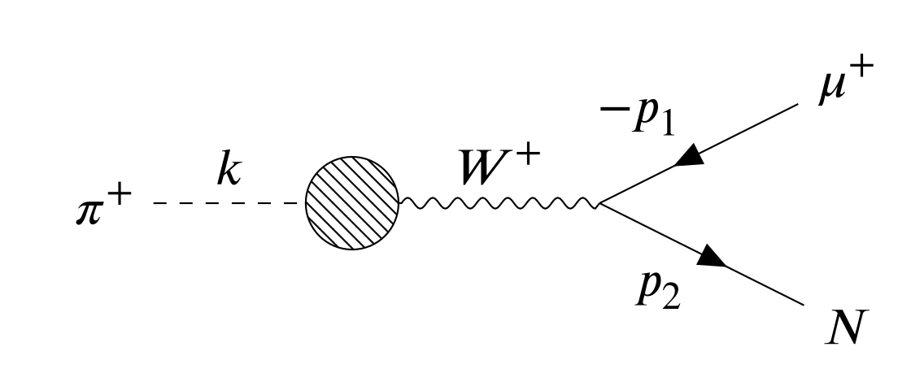
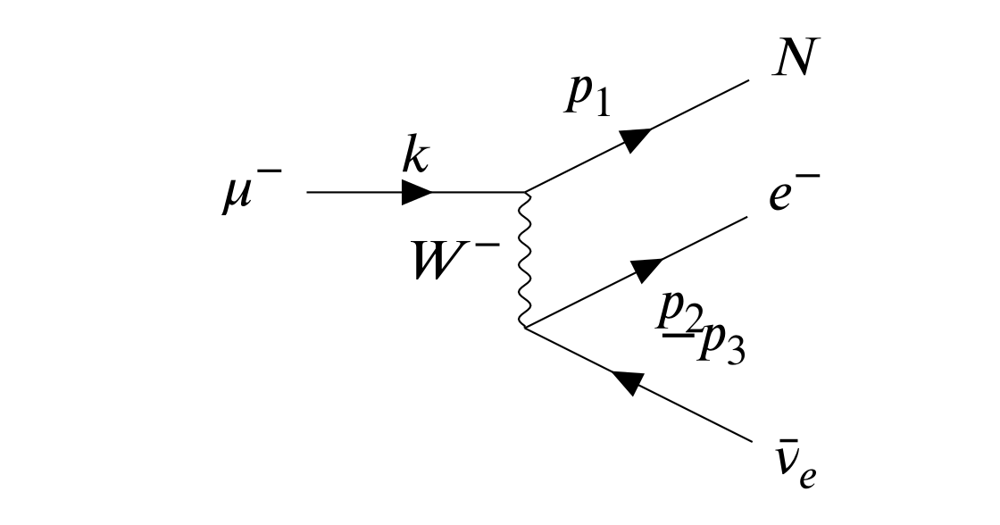
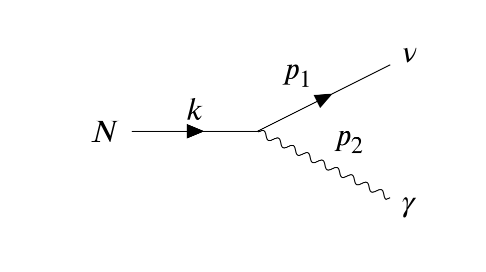
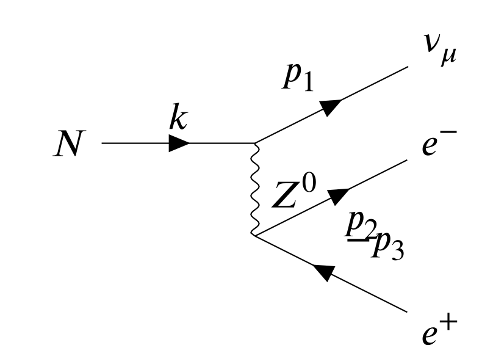

HNL (Heavy Neutral Lepton) is inevitable in a lot of SM expansions which try to explain the origin of neutrino mass, like Type-I Seesaw, Inversed Seesaw, etc.
The massive HNL in decay has more rich phenomenology compared with massless neutrino, for example, it has polarization.

# Pion Decay
When a pion decays into an HNL, the Feynman diagram is

and the amplitude is
$$
  \mathcal{M} = \frac{f_\pi g_w^2}{8 M_W^2} k^\mu [\bar{u}(p_2) \gamma_\mu (1 - \gamma^5) v(p_1)]
$$
Using the canonical way of dealing with amplitudes, it's not difficult to get the decay width.
However, if one wants to take the polorization of HNL in count, the following relation should be used
$$
  u(p_2) \bar{u}(p_2) = (\not{p}_2 + m_N) \frac{1 + \not{s}}{2}
$$
Where $s^\mu$ is the spin 4-vector of HNL particle. In the rest frame of HNL, $s$ of spin parallel/antiparallel with z-axis is
$$
  s_{rest}^\mu = (0, 0, 0, s)
$$
Where $s=\pm 1$. And in a frame other than the rest frame of HNL, a Lorentz Boost needs to be applied. 
In the process of pion decay, we work in the rest frame of pion, and let $p_2$ point towards z-axis, then
$$
  s^\mu = \Lambda^\mu_\nu s_{rest}^\nu = \left(\frac{|p_2|}{m_N} s, 0, 0, \frac{\sqrt{|p_2|^2 + m_N^2}}{m_N} s\right)
$$
Hence $|\mathcal{M}|^2$ is
$$
  \langle |\mathcal{M}| \rangle^2 = \frac{1}{16} \left[ f_\pi^2 \left( \frac{g_w}{M_W} \right)^2 \right]^2 [ 2 (k \cdot p_1) (k \cdot p_2) - k^2 (p_1 \cdot p_2) + 2 m_N (k \cdot p_1) (k \cdot s) - m_N k^2 (p_1 \cdot s) ]
$$
It's a two-body decay, all 4-momentum has a fixed number. Substitute those numbers we can get
$$
  % \Gamma_{\pi \to N}^{(s)} \propto (m_\mu^2 + m_N^2) m_\pi^2 - (m_\mu^2 - m_N^2)^2 - s \cdot (m_\mu^2 - m_N^2) \sqrt{\lambda(m_\pi^2, m_\mu^2, m_N^2)}
  \frac{\Gamma_R}{\Gamma_L} = \frac{(m_\mu^2 + m_N^2) m_\pi^2 - (m_\mu^2 - m_N^2)^2 - (m_\mu^2 - m_N^2) \sqrt{\lambda(m_\pi^2, m_\mu^2, m_N^2)}}
  {(m_\mu^2 + m_N^2) m_\pi^2 - (m_\mu^2 - m_N^2)^2 + (m_\mu^2 - m_N^2) \sqrt{\lambda(m_\pi^2, m_\mu^2, m_N^2)}}
$$
And of course if we sum $s=\pm 1$, which means we don't care about HNL's polariztion in the final state, we have
$$
  \frac{\Gamma_{\pi \to \mu N}}{\Gamma_{\pi \to \mu \nu}} =
  |U_{\mu}|^2 \times \rho_\pi (m_N)
$$
where
$$
\begin{align*}
   & \rho_\pi (m_N) = \frac{(m_\pi^2 (m_\mu^2 + m_N^2) - (m_\mu^2 - m_N^2)^2) \sqrt{\lambda(m_\pi^2, m_\mu^2, m_N^2)}}{m_\mu^2 (m_\pi^2 - m_\mu^2)^2} \\
   & \lambda(x, y, z) = x^2 + y^2 + z^2 - 2xy - 2yz - 2zx
\end{align*}
$$

# Muon Decay

When a muon decays into HNL, we have
$$
  \mathcal{M} = 2\sqrt{2} G_F [\bar{u}(p_1) \gamma_\mu P_L u(k)] \cdot [\bar{u}(p_2) \gamma^\mu P_L v(p_3) ]
$$
Keep HNL's polarization as we've done before, a simple term of $\langle |\mathcal{M}| \rangle^2$ can be obtained
$$
  \langle |\mathcal{M}| \rangle^2 = 32 G_F [(k \cdot p_3)(p_1 \cdot p_2) - m_N (k \cdot p_3) (p_2 \cdot s)]
$$
Get rid of $p_2$ and keep things in order
$$
  \begin{split}
    \langle |\mathcal{M}| \rangle^2 & = 32 G_F^2 m_\mu |\overrightarrow{p}_3| [ \frac{1}{2}(m_\mu^2 - m_N^2)  - |\overrightarrow{p}_3| m_\mu                                  \\
                                    & - s \left(m_\mu |\overrightarrow{p}_1| - |\overrightarrow{p}_3| |\overrightarrow{p}_1| + |\overrightarrow{p}_3| \cos{θ_3} E_1\right) ]
  \end{split}
$$
Where $E_1=\sqrt{|\overrightarrow{p}_1|^2 + m_N^2}$. Integrate to get the decay width
$$
  d \Gamma = \frac{1}{16(2\pi)^4 m_\mu} \frac{d^3 \overrightarrow{p}_1}
  {|\overrightarrow{p}_1| \cdot E_1} d |\overrightarrow{p}_3| \int_{u_-}^{u_+} \langle |\mathcal{M}| \rangle^2 \delta(m_\mu - E_1 - |\overrightarrow{p}_3| - u) \, d u
$$
Where $u^2 \equiv |\overrightarrow{p}_1 + \overrightarrow{p}_3|^2$. Integrate over $u$ then we get
$$
  \Gamma = \frac{1}{(4\pi)^4 m_\mu} \int \frac{d^3 \overrightarrow{p}_1}{|\overrightarrow{p}_1| \cdot E_1} \int_{|\overrightarrow{p}_3|_{-}}^{|\overrightarrow{p}_3|_{+}}
  d |\overrightarrow{p}_3| \langle |\mathcal{M}| \rangle^2
$$
Due to the selecting nature of $\delta$ function, and to make sure the integrate over $\delta$ is not zero, the
following conditions need to be fulfilled
$$
\begin{align*}
  \cos{\theta_3}               & = \frac{2 |\overrightarrow{p}_3| (E_1 - m_\mu) -2 m_\mu E_1 + m_\mu^2 + m_N^2}{2 |\overrightarrow{p}_1| |\overrightarrow{p}_3|} \\
  |\overrightarrow{p}_3|_{\pm} & = \frac{1}{2}(m_\mu \pm |\overrightarrow{p}_1| - E_1)                                                                           \\
\end{align*}
$$
and
$$
  0 < |\overrightarrow{p}_1| < \frac{m_\mu^2-m_N^2}{2 m_\mu}
$$
Done with the integration, substitute in $s$ we can get the answer
$$
\begin{align*}
\frac{\Gamma_{\mu \to N}}{\Gamma_{\mu \to \nu}} &= |U_{\mu}|^2 \times \rho_\mu(m_N) \\
\rho_\mu(m_N) &= - r_N^8 + 8 r_N^6 - 24 r_N^4 \ln(r_N) - 8 r_N^2 + 1 \\
\frac{d\Gamma}{dE} &= \frac{G_F^2 p^2 (3 m_\mu^2 E + 3 m_N^2 E - 4 m_\mu p - 6 m_N^2 m_\mu)}{12 \pi^3 E} \\
\Gamma_{\mu \to N}^{(s)} &\propto \; s \cdot (r_N^8-32 r_N^5+90 r_N^4-96 r_N^3+40 r_N^2-3) \\ 
                         &\; -72 r_N^4 \, \ln{(r_N)} -3 r_N^8+24 r_N^6-24 r_N^2+3
\end{align*}
$$

# HNL Decay
For HNL decay, we work in the rest frame of HNL itself, so the spin 4-vector can be fixed to $(0,0,0,1)$.

## Radiation Decay

Assume HNL has some kind of coupling to photon through a operator below
$$
  \mathcal{L}_{int} = \frac{d}{2} \bar{\nu}_L \sigma_{\mu \nu} F^{\mu \nu} N + h.c. 
$$
then the vertex is
$$
  i \, 2 \, d \, \sigma^{\alpha\beta} q_\beta P_R
$$
Amplitude is
$$
  \mathcal{M} = 2i \, d [\bar{u}(p_1) \sigma^{\alpha\beta} p_{2\beta} P_R u(k)] \epsilon_\alpha(p_2)
$$
Some trivial calculations will reveal
$$
  \langle |\mathcal{M}| \rangle^2 = 4 |d|^2 m_N^3 [m_N + 2 (p_2 \cdot s)] 
$$
Notice that $p_2 \cdot s = \frac{m_N}{2} \cos{\theta_s}$, which gives use the answer
$$
  \frac{d \Gamma}{d \Omega} \propto 1 + \cos{\theta_{s}}
$$

## Lepton Decay

The process which HNL decays into leptons is a neutral-weak process, hence the vertex carries
a factor containing Weak Mixing Angle, so
$$
  \mathcal{M} = \frac{G_F}{\sqrt{2}} [\bar{u}(p_1) \gamma^\mu P_L u(k)] \cdot [ \bar{u}(p_2) (2 s_W^2 - P_L) v(p_3)]
$$
Keep the polarization of HNL will make things really complicated
$$
  \begin{split}
    \langle |\mathcal{M}| \rangle^2 = \frac{G_F^2}{2} \{ & - 8 m_N^2 |\overrightarrow{p}_3|^2 + 4 m_N^3 |\overrightarrow{p}_3| + 32  s_W^2 m_N^2 |\overrightarrow{p}_3|^2 - 16  s_W^2 m_N^3 |\overrightarrow{p}_3|                                                                                                     \\
                                                          & - 32  s_W^4 m_N^2 |\overrightarrow{p}_3|^2 - 32  s_W^4 m_N^2  |\overrightarrow{p}_2|^2 + 16  s_W^4 m_N^3 |\overrightarrow{p}_3|                                                                                                                             \\
                                                          & + 16  s_W^4 m_N^3  |\overrightarrow{p}_2| + 32  |\overrightarrow{p}_2| \cos{\theta_2}  s_W^4 m_N^2  |\overrightarrow{p}_2| - 16  |\overrightarrow{p}_2| \cos{\theta_2}  s_W^4 m_N^3 + 8  |\overrightarrow{p}_3| \cos{\theta_3} m_N^2 |\overrightarrow{p}_3| \\
                                                          & - 4  |\overrightarrow{p}_3| \cos{\theta_3} m_N^3 - 32  |\overrightarrow{p}_3| \cos{\theta_3}  s_W^2 m_N^2 |\overrightarrow{p}_3| + 16  |\overrightarrow{p}_3| \cos{\theta_3}  s_W^2 m_N^3                                                                   \\
                                                          & + 32  |\overrightarrow{p}_3| \cos{\theta_3}  s_W^4 m_N^2 |\overrightarrow{p}_3| - 16  |\overrightarrow{p}_3| \cos{\theta_3}  s_W^4 m_N^3 \}
  \end{split}
$$
If we want to calculate the spectrum of the final state electrons, take the electron assigned with momentum $p_3$ as an example, we first integrate out $\theta_2$. Let the angle between $\overrightarrow{p}_2$ and $\overrightarrow{p}_3$ be $\alpha$, do the substitution which is $u^2 \equiv |\overrightarrow{p}_2 + \overrightarrow{p}_3|^2$, then one can solve the integrate over $\alpha$, and $\cos{\theta_2} = \cos{\alpha} \cos{\theta_3} + \sin{\alpha} \sin{\theta_3} \cos{\varphi}$.

From $\delta(m_N - |\overrightarrow{p}_2 + \overrightarrow{p}_3| - |\overrightarrow{p}_2| - |\overrightarrow{p}_3|)$ one can obtain
$$
  \cos{\alpha} = \frac{m_N^2}{2|\overrightarrow{p}_2||\overrightarrow{p}_3|}-\frac{m_N}{|\overrightarrow{p}_3|}-\frac{m_N}{|\overrightarrow{p}_2|}+1
$$
To make sure $\delta$ function not get 0, we need $\frac{m_N}{2} - |\overrightarrow{p}_3| < |\overrightarrow{p}_2| < \frac{m_N}{2}$. Now the integrate over $|\overrightarrow{p}_2|$ can be done.

At the same time, $0 < \varphi < 2 \pi$, so $\varphi$ can be integrated out pretty easily. The only things left is $|\overrightarrow{p}_3|$ and $\cos{\theta_3}$, so
$$
  \begin{split}
    \frac{d \Gamma}{d |\overrightarrow{p}_3| \, d\cos{\theta_3}} = & \frac{4 G_F \pi m_N^2}{3} |\overrightarrow{p}_3|^2                                                                                \\
                                                                    & \cdot (32 |\overrightarrow{p}_3| s_W^4 \cos{\theta_3}-14 m_N s_W^4 \cos{\theta_3} -24 |\overrightarrow{p}_3| s_W^2 \cos{\theta_3} \\
                                                                    & +12 m_N s_W^2 \cos{\theta_3} +6 |\overrightarrow{p}_3| \cos{\theta_3}-3 m_N \cos{\theta_3}-32 |\overrightarrow{p}_3| s_W^4        \\
                                                                    & +18 m_N s_W^4+24 |\overrightarrow{p}_3| s_W^2-12 m_N s_W^2-6 |\overrightarrow{p}_3|+3 m_N)
  \end{split}
$$
The same thing can be done to the electron assigned with momentum $p_2$.

Also, HNL features a decay which turns into 3 neutrinos. It can be treated similarly to the electron pair decay, and
a lot easier.